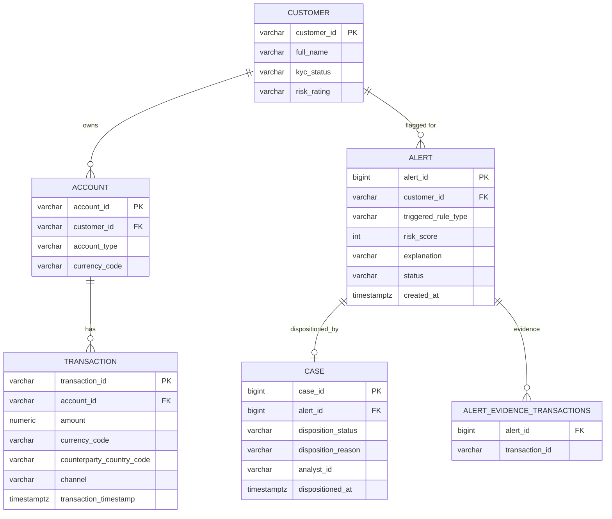

# Sentinel AML — Entity Relationship Diagram

Mirrors `com.sentinel.aml.entity` and the Flyway schema in
`src/main/resources/db/migration/V1__init_schema.sql`.

**Notes:**
- `ALERT_EVIDENCE_TRANSACTIONS.transaction_id` is a plain string reference, not a foreign key to
  `TRANSACTION` — an evidence entry just names the transaction ID that contributed to the alert,
  since one physical transaction can legitimately be evidence for more than one alert (e.g. a
  single large transaction that is also part of a structuring window).
- `ALERT`–`CASE` is 1:1 (`cases.alert_id` is unique) — one disposition record per alert, written
  when an analyst acts on it; an alert with no `Case` row is still `OPEN`.
- No foreign key from `TRANSACTION` back to `CUSTOMER` directly — a customer's transactions are
  always reached through their accounts (`CUSTOMER → ACCOUNT → TRANSACTION`).
